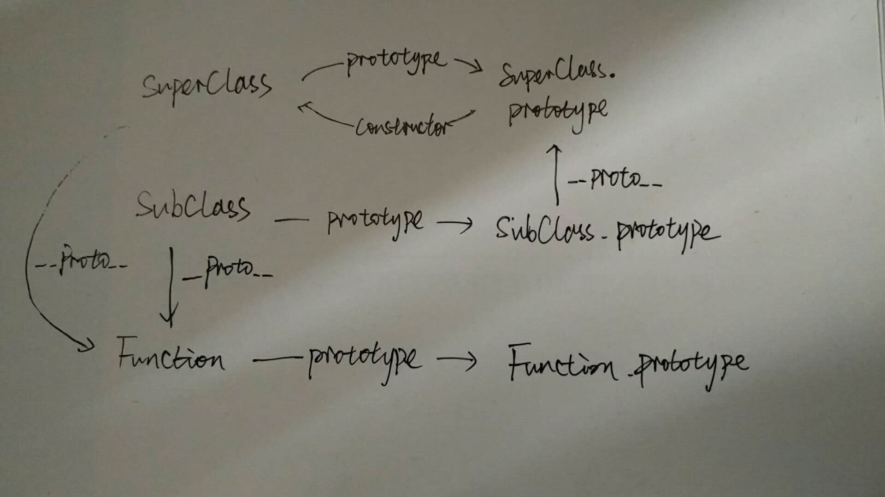

# `instanceof`

- [`instanceof`](#instanceof)
  - [基本用法](#%E5%9F%BA%E6%9C%AC%E7%94%A8%E6%B3%95)
  - [运算符代码](#%E8%BF%90%E7%AE%97%E7%AC%A6%E4%BB%A3%E7%A0%81)
  - [试着分析](#%E8%AF%95%E7%9D%80%E5%88%86%E6%9E%90)
  - [参考](#%E5%8F%82%E8%80%83)
---
## 基本用法

  ``` javascript
  // 判断 foo 是否是 Foo 类的实例 , 并且是否是其父类型的实例
  function Aoo(){} 
  function Foo(){} 
  Foo.prototype = new Aoo();//JavaScript 原型继承
  
  var foo = new Foo(); 
  console.log(foo instanceof Foo)//true 
  console.log(foo instanceof Aoo)//true
  ```

## 运算符代码

  有些比较复杂的情况有时比较难分析，但我们可以从它实现代码去理解

  ``` javascript
  function instance_of(L, R) {
    //L 表示左表达式，R 表示右表达式
    var O = R.prototype;  // 取 R 的显示原型
    L = L.__proto__;      // 取 L 的隐式原型
    while (true) { 
      if (L === null) 
        return false; 
      if (O === L)  // 重点：当 O 严格等于 L 时，返回 true 
        return true; 
      L = L.__proto__; 
    } 
  }
  ```
  另外附有（**重要哦**）：

  

## 试着分析

  - `Object instanceof Object`

  ``` javascript
  // 为了方便表述，首先区分左侧表达式和右侧表达式
  ObjectL = Object, ObjectR = Object; 
  // 下面根据规范逐步推演
  O = ObjectR.prototype = Object.prototype 
  L = ObjectL.__proto__ = Function.prototype 
  // 第一次判断
  O != L 
  // 循环查找 L 是否还有 __proto__ 
  L = Function.prototype.__proto__ = Object.prototype 
  // 第二次判断
  O == L 
  // 返回 true
  ```

  - [继承这一部分](/extend.md)中 `SubClass instanceof SuperClass`

  
  (凑合看吧哈哈哈哈哈 😝)

  可以看到的是
  `SubClass.__proto__` 怎样都不会是 `SuperClass.prototype`，所以判断结果是 `false`

  但如果是 `SubClass.prototype instanceof SuperClass` 就是 `true` 了呀 ~

## 参考

[👉 MDN](https://developer.mozilla.org/zh-CN/docs/Web/JavaScript/Reference/Operators/instanceof)
 
[👉 JavaScript instanceof 运算符深入剖析](https://www.ibm.com/developerworks/cn/web/1306_jiangjj_jsinstanceof/index.html)