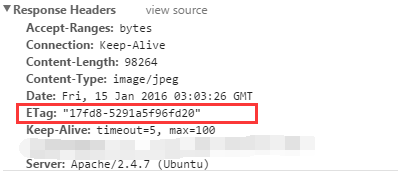

# 缓存小结

- [缓存小结](#%E7%BC%93%E5%AD%98%E5%B0%8F%E7%BB%93)
- [浏览器缓存](#%E6%B5%8F%E8%A7%88%E5%99%A8%E7%BC%93%E5%AD%98)
  - [浏览器缓存基本认识](#%E6%B5%8F%E8%A7%88%E5%99%A8%E7%BC%93%E5%AD%98%E5%9F%BA%E6%9C%AC%E8%AE%A4%E8%AF%86)
  - [强缓存](#%E5%BC%BA%E7%BC%93%E5%AD%98)
    - [强缓存的应用](#%E5%BC%BA%E7%BC%93%E5%AD%98%E7%9A%84%E5%BA%94%E7%94%A8)
    - [补充：from disk cache 和 from memory cache](#%E8%A1%A5%E5%85%85%EF%BC%9Afrom-disk-cache-%E5%92%8C-from-memory-cache)
  - [协商缓存](#%E5%8D%8F%E5%95%86%E7%BC%93%E5%AD%98)
- [服务器端缓存](#%E6%9C%8D%E5%8A%A1%E5%99%A8%E7%AB%AF%E7%BC%93%E5%AD%98)
  - [CDN 缓存](#cdn-%E7%BC%93%E5%AD%98)
    - [使用了 `CDN` 缓存后的网站的访问过程为：](#%E4%BD%BF%E7%94%A8%E4%BA%86-cdn-%E7%BC%93%E5%AD%98%E5%90%8E%E7%9A%84%E7%BD%91%E7%AB%99%E7%9A%84%E8%AE%BF%E9%97%AE%E8%BF%87%E7%A8%8B%E4%B8%BA%EF%BC%9A)
    - [CDN的优势](#cdn%E7%9A%84%E4%BC%98%E5%8A%BF)
- [HTML5缓存](#html5%E7%BC%93%E5%AD%98)
- [参考](#%E5%8F%82%E8%80%83)

---
# 浏览器缓存
## 浏览器缓存基本认识

  分为 **强缓存** 和 **协商缓存**

  - **强缓存**

    浏览器在加载资源时，先根据这个资源的一些 `http header` 判断它是否命中强缓存，强缓存如果命中，浏览器直接从自己的缓存中读取资源，不会发请求到服务器。比如某个 `css` 文件，如果浏览器在加载它所在的网页时，这个 `css` 文件的缓存配置命中了强缓存，浏览器就直接从缓存中加载这个 `css`，连请求都不会发送到网页所在服务器；
    
  - **协商缓存**

    当强缓存没有命中的时候，浏览器一定会发送一个请求到服务器，通过服务器端依据资源的另外一些 `http header` 验证这个资源是否命中协商缓存，如果协商缓存命中，服务器会将这个请求返回，但是不会返回这个资源的数据，而是告诉客户端可以直接从缓存中加载这个资源，于是浏览器就又会从自己的缓存中去加载这个资源

    当协商缓存也没有命中的时候，浏览器直接从服务器加载资源数据

  - 两者共同点：如果命中，都是从客户端缓存中加载资源，而不是从服务器加载资源数据

  - 不同点：强缓存不发请求到服务器，协商缓存会发请求到服务器。

---

## 强缓存

  当浏览器对某个资源的请求命中了强缓存时，返回的 `http` 状态为`200`，在 chrome 的开发者工具的 network 里面 size 会显示为 `from cache`

  怎么实现呢？

  > 强缓存是利用 `expires` 或者 `cache-Control` 这两个` http response header` 实现的，它们都用来表示资源在客户端缓存的有效期。
  
 - `Expires`

   ` Expires` 是 `http1.0` 提出的一个**表示资源过期时间**的 `header`，它描述的是一个绝对时间，由服务器返回，用 `GMT` 格式的字符串表示，如：`Expires:Thu, 31 Dec 2037 23:55:55 GMT`，它的缓存原理是：

   - 浏览器第一次跟服务器请求一个资源，服务器在返回这个资源的同时，在 `respone` 的 `header` 加上 `Expires` 的 `header`

   - 浏览器在接收到这个资源后，会把这个资源连同所有 `response header` 一起缓存下来（所以缓存命中的请求返回的 `header` 并不是来自服务器，而是来自之前缓存的 `header` ）

    - 浏览器再请求这个资源时，先从缓存中寻找，找到这个资源后，拿出它的 `Expires` 跟当前的请求时间比较，如果请求时间在 `Expires` 指定的时间之前，就能命中缓存，否则就不行

    - 如果缓存没有命中，浏览器直接从服务器加载资源时，`Expires Header` 在重新加载的时候会被更新。
    
    `Expires` 是较老的强缓存管理 `header` ，由于它是服务器返回的一个 **绝对时间**，在服务器时间与客户端时间相差较大时，缓存管理容易出现问题，比如随意修改下客户端时间，就能影响缓存命中的结果
    
 - `cache-control`

  > `http1.1` 提出的 `header`, 这是一个相对时间，在配置缓存的时候，以秒为单位，用数值表示，如： `Cache-Control:max-age=315360000` ，它的缓存原理是：

  - 浏览器第一次跟服务器请求一个资源，服务器在返回这个资源的同时，在 `response` 的 `header` 加上 `Cache-Control` 的 `header`
  - 浏览器在接收到这个资源后，会把这个资源连同所有 `response header` 一起缓存下来
  - 浏览器再请求这个资源时，先从缓存中寻找，找到这个资源后，根据它第一次的请求时间和 `Cache-Control` 设定的有效期，计算出一个资源过期时间，再拿这个过期时间跟当前的请求时间比较，如果请求时间在过期时间之前，就能命中缓存，否则就不行
  - 如果缓存没有命中，浏览器直接从服务器加载资源时，`Cache-Control Header` 在重新加载的时候会被更新
  
  这两个 `header` 可以只启用一个，也可以同时启用，当 `response header` 中，`Expires` 和 `Cache-Control` 同时存在时，**`Cache-Control` 优先级高于 `Expires：`**

 ### 强缓存的应用

  对于有大量**静态资源**的网页利用强缓存，提高响应速度。
  
  通常的做法是，为这些静态资源全部配置一个超时时间超长的 `Expires` 或 `Cache-Control` ，这样用户在访问网页时，只会在第一次加载时从服务器请求静态资源，其它时候只要缓存没有失效并且用户没有强制刷新的条件下都会从自己的缓存中加载

  当然也有问题，发布时**资源更新**的问题
  
 ### 补充：from disk cache 和 from memory cache

  Chrome 在高版本更新了缓存策略，原来的 from cache 变成了 `from disk cache`(磁盘缓存) 和 `from memory cache`(内存缓存) 两类，两者有什么区别呢？

  > 内存缓存是和渲染进程绑定的，大部分情况下于浏览器Tab对应

  初次打开tab：

  

  再次打开：

  

  可以看到，在**命中强缓存的情况下**，进程初次渲染会从磁盘读取缓存资源。Chrome 会将部分资源保存到内存中。

  由于内存缓存是直接从内存中读取的，所以速度更快，从图中可以看出时间是 0ms 。而磁盘缓存还需要从磁盘中读取，速度还和磁盘的I/O有关，时间大概在2～10ms，也是相当快的了。

  stack overflow 上的一个回答：

  > Like their names said:
  >
  >"**Memory Cache**" stores and loads resources to and from Memory (RAM). So this is much faster but it is non-persistent. Content is available **until you close the Browser**.
  >
  > "**Disk Cache**" is persistent. Cached resources are stored and loaded to and from disk.
  >
  > Simple Test: Open Chrome Developper Tools / Network. Reload a page multiple times. The table column "Size" will tell you that some files are loaded "from memory cache". Now close the browser, open Developper Tools / Network again and load that page again. All cached files are loaded "from disk cache" now, because your memory cache is empty.
  
---

## 协商缓存

  > 当浏览器对某个资源的请求**没有命中强缓存**，就会发一个请求到服务器，验证协商缓存是否命中，如果协商缓存命中，请求响应返回的 `http` 状态为 `304` 并且会显示一个 `Not Modified` 的字符串.

  协商缓存是利用的是 `Last-Modified，If-Modified-Since` 和 `ETag、If-None-Match` 这两对 `Header` 来管理的。

  - `Last-Modified，If-Modified-Since` :

    - 浏览器第一次跟服务器请求一个资源，服务器在返回这个资源的同时，在 `respone` 的 `header` 加上 `Last-Modified` 的 `header` ，这个 `header` 表示这个资源在服务器上的**最后修改时间**

    - 浏览器再次跟服务器请求这个资源时，在 `request` 的 `header` 上加上 `If-Modified-Since` 的 `header` ，这个 `header` 的值就是上一次请求时返回的 `Last-Modified` 的值
    
    -  服务器再次收到资源请求时，根据浏览器传过来 `If-Modified-Since` 和资源在服务器上的最后修改时间判断资源是否有变化，如果没有变化则返回 `304 Not Modified` ，但是不会返回资源内容；如果有变化，就正常返回资源内容。
    
        当服务器返回 `304 Not Modified` 的响应时，`response header` 中不会再添加 `Last-Modified `的 `header` ，因为既然资源没有变化，那么 `Last-Modified` 也就不会改变

    - 浏览器收到 `304` 的响应后，就会从缓存中加载资源。

    - 如果协商缓存没有命中，浏览器直接从服务器加载资源时，`Last-Modified Header` 在重新加载的时候会被更新，下次请求时，`If-Modified-Since` 会启用上次返回的 `Last-Modified` 值

    `Last-Modified`，`If-Modified-Since` 都是根据服务器时间返回的 `header` ，一般来说，在没有调整服务器时间和篡改客户端缓存的情况下，这两个 `header` 配合起来管理协商缓存是非常可靠的
    
    但是有时候也会服务器上**资源其实有变化，但是最后修改时间却没有变化**的情况，而这种问题又很不容易被定位出来，而当这种情况出现的时候，就会影响协商缓存的可靠性。所以就有了另外一对 `header` 来管理协商缓存
    
  - `ETag、If-None-Match`:

    - 浏览器第一次跟服务器请求一个资源，服务器在返回这个资源的同时，在 `response` 的 `header` 加上 `ETag` 的 `header` ，这个 `header` 是**服务器根据当前请求的资源生成的一个唯一标识**，这个唯一标识是一个字符串，只要资源有变化这个串就不同，跟最后修改时间没有关系，所以能很好的补充 `Last-Modified` 的问题：
    

    - 浏览器再次跟服务器请求这个资源时，在 `request` 的 `header` 上加上 `If-None-Match` 的 `header` ，这个 `header` 的值就是上一次请求时返回的 `ETag` 的值：
    

    - 服务器再次收到资源请求时，根据浏览器传过来 `If-None-Match` 和然后再根据资源生成一个新的 `ETag` ，如果这两个值相同就说明资源没有变化，否则就是有变化；如果没有变化则返回 `304 Not Modified` ，但是不会返回资源内容；如果有变化，就正常返回资源内容。
    
        与  `Last-Modified` 不一样的是，当服务器返回 `304 Not Modified` 的响应时，由于 `ETag` 重新生成过，`response header` 中还会把这个`ETag`返回，即使这个`ETag`跟之前的没有变化

    - 浏览器收到 `304` 的响应后，就会从缓存中加载资源。

  协商缓存跟强缓存不一样，**强缓存不发请求到服务器**，所以有时候资源更新了浏览器还不知道，但是协商缓存会发请求到服务器，所以资源是否更新，服务器肯定知道

---
# 服务器端缓存

 ## CDN 缓存

  > CDN (Content Delivery Network 内容分发网络) 缓存，也叫网关缓存、反向代理缓存。
  
  > 目的是通过在现有的Internet中增加一层新的网络架构，将网站的内容发布到最接近用户的网络"边缘"，使用户可 以就近取得所需的内容，解决Internet网络拥塞状况，提高用户访问网站的响应速度。

  ### 使用了 `CDN` 缓存后的网站的访问过程为：

   - 用户向浏览器提供要访问的域名；

   - 浏览器调用域名解析库对域名进行解析，由于``对域名解析过程进行了调整，所以解析函数库一般得到的是该域名对应的CNAME记录（由于现在已经是使用了CDN服务，CNAME为CDN服务商域名），为了得到实际IP地址，浏览器需要再次对获得的CNAME域名进行解析以得到实际的IP地址；在此过程中，使用全局负载均衡DNS解析，如根据地理位置信息解析对应的IP地址，使得用户能就近访问。（**CDN服务来提供最近的服务器**）

   - 此次解析得到CDN缓存服务器的IP地址，浏览器在得到实际的IP地址以后，向缓存服务器访问请求；

   - 缓存服务器根据浏览器提供的要访问的域名，通过Cache内部专用DNS解析得到此域名的实际IP地址，再由缓存服务器向此实际IP地址提交访问请求；

   - 缓存服务器从实际IP地址得得到内容以后，一方面在本地进行保存，以备以后使用，二方面把获取的数据返回给客户端，完成数据服务过程；

   - 客户端得到由缓存服务器返回的数据以后显示出来并完成整个浏览的数据请求过程。

  ### CDN的优势

   - CDN节点解决了跨运营商和跨地域访问的问题，访问延时大大降低；
   - 大部分请求在**CDN边缘节点**完成，CDN起到了**分流作用**，减轻了源站的负载。

---
# HTML5缓存

 - [WebStorage](../HTML/WebStorage.md)
 - [HTML5离线存储(还不会嘻嘻😂)](../HTML/HTML5离线存储.md)

---

# 参考

- [浏览器缓存知识小结及应用](https://www.cnblogs.com/lyzg/p/5125934.html)

- [缓存策略](http://imweb.io/topic/55c6f9bac222e3af6ce235b9)

- [你应该知道的浏览器缓存知识](https://excaliburhan.com/post/things-you-should-know-about-browser-cache.html)

 👉 [我伦的缓存知识总结](https://github.com/byronlun/prepare-for-FE-interview/blob/master/others/%E7%BC%93%E5%AD%98%E7%9F%A5%E8%AF%86%E6%80%BB%E7%BB%93.md)